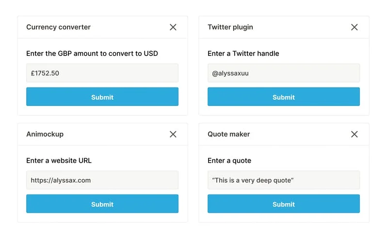

# Slashy


<br>
<br>
Supercharge Notion with custom commands to record, draw, and more ✨

Slashy is an open source extension that lets you create custom commands for Notion. Make camera and audio recordings, draw, create reusable components and much more - all for free.

👉 Get it now [for Chrome]([https://chrome.google.com/webstore/detail/omni/mapjgeachilmcbbokkgcbgpbakaaeehi?hl=en&authuser=0](https://chrome.google.com/webstore/detail/ccjlpkignaedigchcklcipfbecijllca)) and [for Firefox]([https://addons.mozilla.org/en-GB/firefox/addon/omnisearch/](https://addons.mozilla.org/en-US/firefox/addon/slashy/))

<a href="https://www.producthunt.com/posts/slashy?utm_source=badge-top-post-badge&utm_medium=badge&utm_souce=badge-slashy" target="_blank"></a>

Made by [Alyssa X](https://twitter.com/alyssaxuu)

## Table of contents

- [Features](#features)
- [Slashy SDK](#slashy-sdk)
 - [Show modal]($show-modal)
 - [Write to Notion](#write-to-notion)
 - [Add image](#add-image) 
- [Self-hosting Slashy](#self-hosting-slashy)
	- [Installing on Chrome](#installing-on-chrome)
	- [Installing on Firefox](#installing-on-firefox) 
- [Libraries used](#libraries-used)

## Features

⚡️ Create your own Notion custom commands, accessible with the slash key<br>
📹 Make video and audio recordings without leaving Notion with /record<br>
🖌️ Make drawings and annotations for your Notion page with /draw<br>
✍️ Easily make commands for reusable blocks and content<br>
🤖 Develop your own plugins with the Slashy SDK<br>
🗄 Manage and edit your commands easily through the Notion sidebar<br>
⚙️ Toggle command visibility and other settings<br>
...and much more - all for free & no sign in needed!<br>

## Slashy SDK

I've added a few methods to make it easier to interact with Notion and create custom plugins in Slashy. You can use these methods in the Javascript field when creating a new command (make sure to set the command type to "Script").

### Show modal
```javascript
showModal(label, placeholder, onsubmit)
```
Displays a modal with an input field that you can use for a variety of plugins, for example:


The title of the modal will be the same as the name of your command.

|**Parameter**| **Type** | **Description** |
|--|--|--|
| `label` | *String* | The label that will show on the modal above the input. |
| `placeholder` | *String* | The placeholder text in the input. |
| `onsubmit` | *Function(result)* | The function that gets called when the user submits the modal. Should have one parameter to return the input value. |

### Write to Notion
```javascript
writeToNotion(content)
```
Inserts any sort of text (markdown included) into Notion where the user triggered the slash command.

|**Parameter**| **Type** | **Description** |
|--|--|--|
| `content` | *String* | The text to add to the Notion page. |

### Add image
```javascript
addImageBlob(blob)
```
Adds an image to the Notion page where the user triggered the slash command.

|**Parameter**| **Type** | **Description** |
|--|--|--|
| `blob` | *Blob (type `image/png` only)* | The image to add to the Notion page. |

Feel free to suggest new methods for Slashy by [making an issue](https://github.com/alyssaxuu/slashy/issues/new).

## Self-hosting Slashy
You can run Slashy locally without having to install it from the Chrome Store or from Firefox Add-ons.

### Installing on Chrome

1. Download the code. In the web version of GitHub, you can do that by clicking the green "Code" button, and then "Download ZIP".
2. Go to chrome://extensions/ in your browser, and [enable developer mode](https://developer.chrome.com/docs/extensions/mv2/faq/#:~:text=You%20can%20start%20by%20turning,a%20packaged%20extension%2C%20and%20more.).
3. Drag the [mv3 folder](https://github.com/alyssaxuu/slashy/tree/master/mv3) (make sure it's a folder and not a ZIP file, so unzip first), or click on the "Load unpacked" button and locate the folder.
4. That's it, you will now be able to use Slashy locally.

### Installing on Firefox

1. Download the code. In the web version of GitHub, you can do that by clicking the green "Code" button, and then "Download ZIP".
2. Open the about:debugging page in your browser, click the "This Firefox" option.
3. Click the "Load Temporary Add-on" button, and select any file inside the [mv2 folder](https://github.com/alyssaxuu/slashy/tree/master/mv2)
4. You might need to add a [temporary extension ID](https://developer.mozilla.org/en-US/docs/Mozilla/Add-ons/WebExtensions/manifest.json/browser_specific_settings#extension_id_format) in the manifest.json in order to be able to use storage. 
5. That's it, you will now be able to use Slashy locally.

## Libraries used

- [jQuery](https://jquery.com/) - for better event handling and DOM manipulation
- [FabricJs](http://fabricjs.com/) - for the drawing plugin
- [SvalJs](https://github.com/Siubaak/sval) - to be able to execute custom scripts (eval doesn't work in MV3)

#

Feel free to reach out to me through email at hi@alyssax.com or [on Twitter](https://twitter.com/alyssaxuu) if you have any questions or feedback! Hope you find this useful 💜
